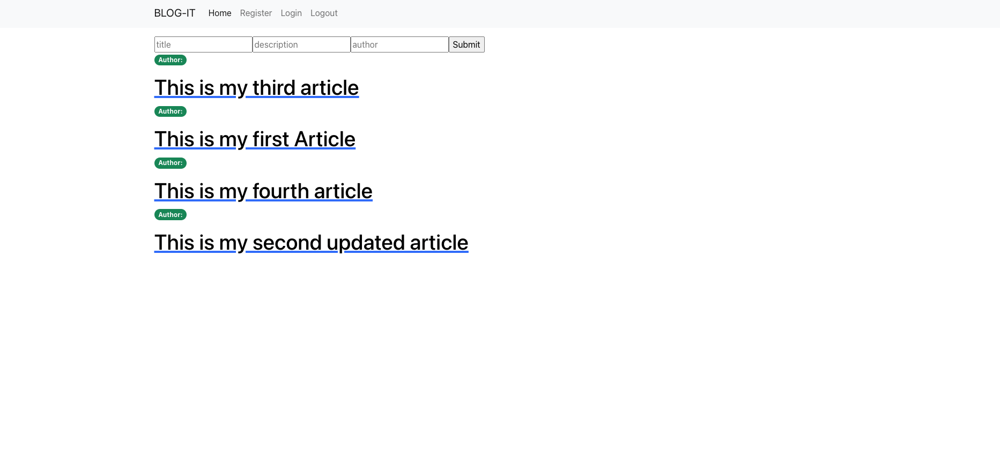
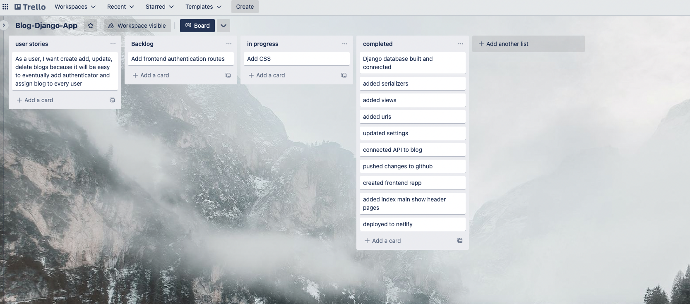

# Django_React_App

# Blog-it
---

### Project Description:  BLOG-IT is a full CRUD-DJANGO-REACT application. 

---

### User Stories 

#### As a user be able to add, delete update blogs

---

### Wireframes
#### 

---

### App Screenshot
#### 
---
### ERD

#### title - text
#### description -text
#### slug - pk
#### published -datetime

---

### Technologies Used:
#### 1. PostgreSQL
#### 2. Django
#### 3. React
#### 4. Netlify
#### 5. Trello
#### 6. VS Code

---

### Getting Started: 
#### TRELLO BOARD: https://trello.com/b/itE9qikd/blog-django-app#
#### 
---

#### Netlify Link: https://idyllic-marshmallow-26d96f.netlify.app/blogs
#### Backend Link: https://github.com/sonamkaria/Django_React_App
#### Frontend Link: https://github.com/sonamkaria/Django_React_App_Frontend
---

### Future Enhancements: 
#### 1. Add Search Bar
#### 2. Expand dataset to include more tables
#### 3. Styling
#### 4. Authentication
#### 5. Add dark/light mode 